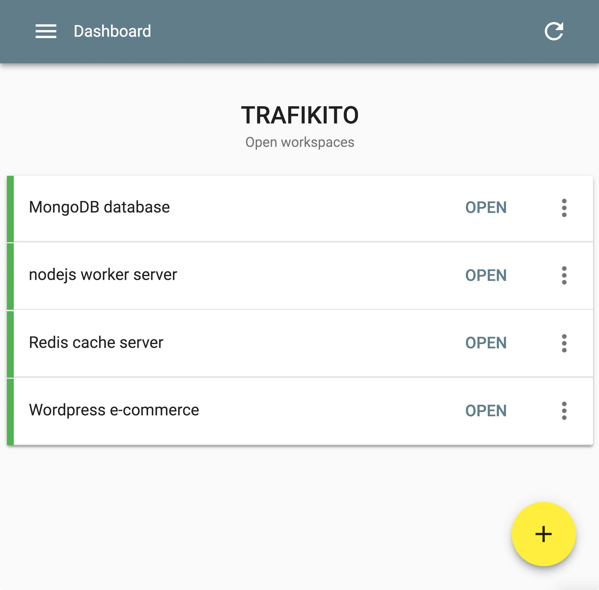
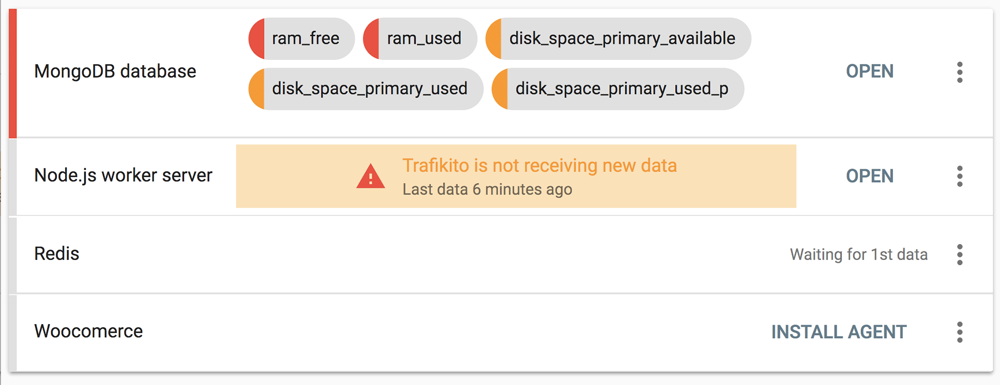

With Trafikito you can monitor many Linux <wiki>servers</wiki> at once and organize them into <wiki>workspaces</wiki>. Even with the <wiki>free plan</wiki>, a single <wiki>workspace</wiki> can hold up to 10 <wiki>servers</wiki>. 

The <wiki>servers list</wiki> is automatically refreshed every 30 seconds, so you can keep it open on a separate screen to always see the <wiki>overview</wiki> of your machines.

<!--more-->

The servers list is an overview of everything you have
------------------------------------------------------

In the <wiki>servers list</wiki> you can:

*   See if all servers are running smoothly
*   See if all servers are up and <wiki>sending data</wiki> to Trafikito
*   See if <wiki>Trafikito agent</wiki> is already installed and waiting for the 1st data to come
*   Get instructions how to <wiki>install</wiki> or <wiki>uninstall</wiki> Trafikito <wiki>agent</wiki> from your server

<info>
While on the servers list you can do and see a lot, you will notice that the interface is clean and there’s no visual noise.
</info> 

If everything with the server is great - you will just see the server name with a green status on the left.

<gif></gif>

If something is going wrong, you will immediately notice. You can hover over any <wiki>variables</wiki> to see details. Click “Open” to dive into the full <wiki>dashboard</wiki> for the <wiki>selected server</wiki>.

<gif></gif>

Conclusion
----------

The <wiki>servers list</wiki> is the first stop to an overview of all your machines at once. 

You can see immediately if everything is fine or if some servers are experiencing issues. 

You can always get additional info by simply clicking “Open”.

A single <wiki>workspace</wiki> may contain 10 servers with the <wiki>free plan</wiki> and even more with the <wiki>paid plans</wiki>. 

<info>
It is important to note that when you buy a plan you buy it for a <wiki>workspace</wiki>. All the <wiki>servers</wiki> in the same <wiki>workspace</wiki> can benefit from a higher <wiki>plan</wiki>.
</info>