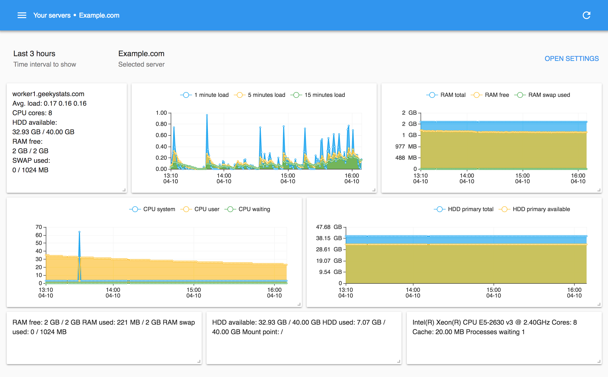

Trafikito is a monitoring system which allows you to track any output of any command and take automatic action when things happen.

<!--more-->

Trafikito is available for everyone
------------------------------

Trafikito is the game changer in monitoring. All tools allow you to monitor specific things and with Trafikito you can literally monitor <wiki>output</wiki> of any <wiki>command</wiki> running on your linux machine.

I am super excited to finally be able to show off Trafikito. 

Thank you for all the support along the way and especially for patiently awaiting this day. Truly, it means a lot to me. 

A lot has been done but there is a huge horizon for the future development.

<quote>
The main goal is to make a stable tool which provides information in a new way for <wiki>free</wiki>, for everyone and with smart defaults yet powerful configurable options.
</quote>

I have personally tested it with many different Linux machines - Ubuntu, CentOS, and others. On VPNs and Google Cloud instances. I believe it should already provide good insights for many individuals and companies.

Other tools remove free plans and become overpriced
-----------------

Before Trafikito I was using New Relic. Which is a great application that can provide a lot but it now comes with a big price tag. 

<quote>
Indeed, they have removed <wiki>free plan</wiki>. I am not sure why but I would do anything to keep the <wiki>free plan</wiki> option.
</quote>
 
I think the internet is a great place for everyone because of the freedom. Absolutely anybody can learn how to code and build solutions for themselves and even others.
 
The best part is that this can be done WITHOUT paywalls.

The Internet is created by people using only a few fundamental tools. Hosting and domain are the first items. Then you must ensure that your server is up and running. 

<quote>It's fun and interesting to create solutions but people will not be able to use it if they are not running.</quote> 

You can’t go and check your server every single minute to ensure that it's all good. Plus no one would want to be doing that every minute. That's why you need monitoring.

Trafikito is easy
-----------------

No black magic, no more closed source agents. 

<info>Trafikito <wiki>agent</wiki> running on your server is pure <wiki>open source</wiki> POSIX shell files.</info> 

They will do nothing but execute standard, built-in functions that shows RAM usage information e.g. how much free ram you have at the moment. It can run any other command also and monitor literally anything from the output.

<quote>Trafikito collects output and sends it to the AWS hosted <wiki>Trafikito cloud</wiki>.</quote>

In the <wiki>dashboard</wiki>, you can see <wiki>default charts</wiki> or customization settings.

By default, you will see CPU, RAM, disk space related information but you can always add a new <wiki>data source</wiki> and track anything else, e.g. count of queries to the database.

<info>Trafikito can track and show graphical data for <wiki>any command</wiki> available in your system.</info>
 
 For instance, applications, such as MongoDB and MySQL provide commands that show statistical information about the running application. In turn, Trafikito can track these stats and show them in a graph.

Even though Trafikito is just a baby it's growing rapidly. Have you tried it with your server as yet? If so, make sure to leave a comment. Please say what you found interesting and what you would like to see in the future releases.